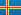
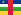
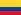
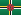
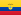
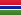
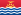
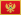
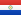

# Flags
This set currently includes the 255 flags below:

| Flag | Code | Region |
| :-------------: | :-------------: | ------------- |
|  | AD | Andorra
|  | AE | United Arab Emirates
|  | AF | Afghanistan
|  | AG | Antigua & Barbuda
|  | AI | Anguilla
|  | AL | Albania
|  | AM | Armenia
|  | AO | Angola
|  | AR | Argentina
|  | AS | American Samoa
|  | AT | Austria
|  | AU | Australia
|  | AW | Aruba
|  | AX | Åland Islands
|  | AZ | Azerbaijan
|  | BA | Bosnia & Herzegovina
|  | BB | Barbados
|  | BD | Bangladesh
|  | BE | Belgium
|  | BF | Burkina Faso
|  | BG | Bulgaria
|  | BH | Bahrain
|  | BI | Burundi
|  | BJ | Benin
|  | BL | St. Barthélemy
|  | BM | Bermuda
|  | BN | Brunei
|  | BO | Bolivia
|  | BR | Brazil
|  | BS | Bahamas
|  | BT | Bhutan
|  | BV | Bouvet Island
|  | BW | Botswana
|  | BY | Belarus
|  | BZ | Belize
|  | CA | Canada
|  | CC | Cocos (Keeling) Islands
|  | CD | Congo - Kinshasa
|  | CF | Central African Republic
|  | CG | Congo - Brazzaville
|  | CH | Switzerland
|  | CI | Côte d’Ivoire
|  | CK | Cook Islands
|  | CL | Chile
|  | CM | Cameroon
|  | CN | China
|  | CO | Colombia
|  | CR | Costa Rica
|  | CU | Cuba
|  | CV | Cape Verde
|  | CW | Curaçao
|  | CX | Christmas Island
|  | CY | Cyprus
|  | CZ | Czech Republic
|  | DE | Germany
|  | DJ | Djibouti
|  | DK | Denmark
|  | DM | Dominica
|  | DO | Dominican Republic
|  | DZ | Algeria
|  | EC | Ecuador
|  | EE | Estonia
|  | EG | Egypt
|  | ER | Eritrea
|  | ES | Spain
|  | ET | Ethiopia
|  | EU | European Union
|  | FI | Finland
|  | FJ | Fiji
|  | FK | Falkland Islands
|  | FM | Micronesia
|  | FO | Faroe Islands
|  | FR | France
|  | GA | Gabon
|  | GB | United Kingdom
|  | GB-ENG | England
|  | GB-NIR | Northern Ireland
|  | GB-SCT | Scotland
|  | GB-WLS | Wales
|  | GB-ZET | Shetland
|  | GD | Grenada
|  | GE | Georgia
|  | GF | French Guiana
|  | GG | Guernsey
|  | GH | Ghana
|  | GI | Gibraltar
|  | GL | Greenland
|  | GM | Gambia
|  | GN | Guinea
|  | GP | Guadeloupe
|  | GQ | Equatorial Guinea
|  | GR | Greece
|  | GS | So. Georgia & So. Sandwich Isl.
|  | GT | Guatemala
|  | GU | Guam
|  | GW | Guinea-Bissau
|  | GY | Guyana
|  | HK | Hong Kong (China)
|  | HM | Heard & McDonald Islands
|  | HN | Honduras
|  | HR | Croatia
|  | HT | Haiti
|  | HU | Hungary
|  | ID | Indonesia
|  | IE | Ireland
|  | IL | Israel
|  | IM | Isle of Man
|  | IN | India
|  | IO | British Indian Ocean Territory
|  | IQ | Iraq
|  | IR | Iran
|  | IS | Iceland
|  | IT | Italy
|  | JE | Jersey
|  | JM | Jamaica
|  | JO | Jordan
|  | JP | Japan
|  | KE | Kenya
|  | KG | Kyrgyzstan
|  | KH | Cambodia
|  | KI | Kiribati
|  | KM | Comoros
|  | KN | St. Kitts & Nevis
|  | KP | North Korea
|  | KR | South Korea
|  | KW | Kuwait
|  | KY | Cayman Islands
|  | KZ | Kazakhstan
|  | LA | Laos
|  | LB | Lebanon
|  | LC | St. Lucia
|  | LGBT | Pride
|  | LI | Liechtenstein
|  | LK | Sri Lanka
|  | LR | Liberia
|  | LS | Lesotho
|  | LT | Lithuania
|  | LU | Luxembourg
|  | LV | Latvia
|  | LY | Libya
|  | MA | Morocco
|  | MC | Monaco
|  | MD | Moldova
|  | ME | Montenegro
|  | MF | St. Martin
|  | MG | Madagascar
|  | MH | Marshall Islands
|  | MK | Macedonia
|  | ML | Mali
|  | MM | Myanmar (Burma)
|  | MN | Mongolia
|  | MO | Macau (China)
|  | MP | Northern Mariana Islands
|  | MQ | Martinique
|  | MR | Mauritania
|  | MS | Montserrat
|  | MT | Malta
|  | MU | Mauritius
|  | MV | Maldives
|  | MW | Malawi
|  | MX | Mexico
|  | MY | Malaysia
|  | MZ | Mozambique
|  | NA | Namibia
|  | NC | New Caledonia
|  | NE | Niger
|  | NF | Norfolk Island
|  | NG | Nigeria
|  | NI | Nicaragua
|  | NL | Netherlands
|  | NO | Norway
|  | NP | Nepal
|  | NR | Nauru
|  | NU | Niue
|  | NZ | New Zealand
|  | OM | Oman
|  | PA | Panama
|  | PE | Peru
|  | PF | French Polynesia
|  | PG | Papua New Guinea
|  | PH | Philippines
|  | PK | Pakistan
|  | PL | Poland
|  | PM | St. Pierre & Miquelon
|  | PN | Pitcairn Islands
|  | PR | Puerto Rico
|  | PS | Palestinian Territories
|  | PT | Portugal
|  | PW | Palau
|  | PY | Paraguay
|  | QA | Qatar
|  | RE | Réunion
|  | RO | Romania
|  | RS | Serbia
|  | RU | Russia
|  | RW | Rwanda
|  | SA | Saudi Arabia
|  | SB | Solomon Islands
|  | SC | Seychelles
|  | SD | Sudan
|  | SE | Sweden
|  | SG | Singapore
|  | SH | St. Helena
|  | SI | Slovenia
|  | SJ | Svalbard & Jan Mayen
|  | SK | Slovakia
|  | SL | Sierra Leone
|  | SM | San Marino
|  | SN | Senegal
|  | SO | Somalia
|  | SR | Suriname
|  | SS | South Sudan
|  | ST | São Tomé & Príncipe
|  | SV | El Salvador
|  | SX | Sint Maarten
|  | SY | Syria
|  | SZ | Swaziland
|  | TC | Turks & Caicos Islands
|  | TD | Chad
|  | TF | French Southern Territories
|  | TG | Togo
|  | TH | Thailand
|  | TJ | Tajikistan
|  | TK | Tokelau
|  | TL | Timor-Leste
|  | TM | Turkmenistan
|  | TN | Tunisia
|  | TO | Tonga
|  | TR | Turkey
|  | TT | Trinidad & Tobago
|  | TV | Tuvalu
|  | TW | Taiwan
|  | TZ | Tanzania
|  | UA | Ukraine
|  | UG | Uganda
|  | UM | U.S. Outlying Islands
|  | US | United States
|  | US-CA | California
|  | UY | Uruguay
|  | UZ | Uzbekistan
|  | VA | Vatican City
|  | VC | St. Vincent & Grenadines
|  | VE | Venezuela
|  | VG | British Virgin Islands
|  | VI | U.S. Virgin Islands
|  | VN | Vietnam
|  | VU | Vanuatu
|  | WF | Wallis & Futuna
|  | WS | Samoa
|  | XK | Kosovo
|  | YE | Yemen
|  | YT | Mayotte
|  | ZA | South Africa
|  | ZM | Zambia
|  | ZW | Zimbabwe
